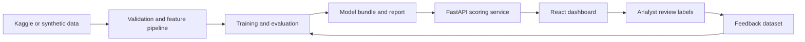

# Architecture

Sentinel has four loops: data preparation, model training, online scoring, and analyst feedback.

The model bundle contains the fitted transformer, estimator, threshold metadata, calibration metadata, and explanation configuration so training and serving use the same feature contract.

